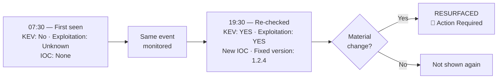

# Cyber Intelligence Radar

Cyber Intelligence Radar is a self-hosted intelligence monitoring and
research system that tracks news and academic literature, merges
duplicate events, detects meaningful changes, prioritizes information
for the user, and produces evidence-aware briefings.

**It does not just ask "Is this new?" — it asks "What actually
changed?"**

*Track what matters. Resurface only what changed.*

## Why this exists

Most feed tools and AI digest bots answer one question well: is this
item new? They're much weaker at the question that actually matters day
to day: is this item *still the same as when I last saw it*, or did
something happen that changes what I should do about it? A CVE reported
this morning with no known exploitation can have a public IOC and
confirmed active exploitation by evening — a tool that just re-lists or
re-summarizes headlines has no way to notice that. This project exists
to answer that second question, for both operational security news and
academic literature.

## What makes it different

1. **Material Change Detection** — the same underlying event is tracked
   across runs and only re-surfaced when something material actually
   changes about it (a KEV listing, a new IOC, confirmed exploitation, a
   fix shipping) — not every time a source re-publishes it. See the
   worked example below.
2. **Personalized / Operational Relevance** — news is split into four
   independent categories per reader (🚨 Action Required, 🕵️ Hunt
   Opportunity, 📚 Technical Learning, 👀 Awareness), and academic
   relevance is scored against your own configured research profiles,
   not a one-size-fits-all feed.
3. **Evidence-First Analysis** — structured claims (CVE IDs, IOCs, CWE
   mappings) extracted by the LLM are mechanically re-checked against
   the original source text after generation; a claim that doesn't
   literally appear in the source is dropped before it reaches you.
4. **Operational News + Academic Intelligence** — one pipeline covers
   both the "what's happening right now" side and the "what's worth
   reading in the literature" side, sharing the same collection,
   dedup, and relevance infrastructure but with independent LLM budgets
   so one never starves the other.

Secondary, still-production capabilities: recovery/backfill, a
cross-process-safe rate limiter, per-source collector health and anomaly
detection, persistent reading state, an optional Google Drive archive
queue, sanitized systemd deployment examples, a 358-test suite, and a
documented security review — see [Key Features](#key-features) below.

## Material update example

```
07:30
CVE-2026-DEMO
KEV: No
Active exploitation: Unknown
IOC: None

        ↓
same event monitored
        ↓

19:30
CVE-2026-DEMO
KEV: YES
Active exploitation: YES
New IOC: 203.0.113.42
Fixed version: 1.2.4

        ↓

RESURFACED

Reason:
MATERIAL UPDATE
```

Illustrative, synthetic values (CVE-2026-DEMO isn't a real CVE) —
matching the real comparator logic in `cyber_radar/dedup.py`. Full
version with the "why" behind each field:
[examples/output/sample_material_update.md](examples/output/sample_material_update.md).



## Sample output / demo

No API keys, network access, or database needed:

```bash
cyber-radar demo
```

Full captured examples: [examples/output/sample_digest.md](examples/output/sample_digest.md),
[sample_collector_health.md](examples/output/sample_collector_health.md),
[sample_material_update.md](examples/output/sample_material_update.md).
A demo video script (not yet recorded) is at
[docs/DEMO.md](docs/DEMO.md).

## Architecture

```mermaid
flowchart TB
    subgraph RSS["Traditional RSS Reader"]
        direction LR
        r1[Fetch] --> r2[List]
    end
    subgraph AI["AI News Summarizer"]
        direction LR
        a1[Fetch] --> a2[Summarize]
    end
    subgraph CIR["Cyber Intelligence Radar"]
        direction LR
        c1[Collect] --> c2[Normalize] --> c3[Deduplicate] --> c4[Merge Event]
        c4 --> c5[Detect Material Change] --> c6[Enrich] --> c7[Evaluate Relevance]
        c7 --> c8[Verify Evidence] --> c9[Prioritize] --> c10[Brief]
        c10 --> c11[Archive] --> c12[Recover] --> c13[Feed Research Workflows]
    end
```



Full pipeline diagram, budget isolation, provenance guards, backfill,
rate limiting, and health checks: [docs/ARCHITECTURE.md](docs/ARCHITECTURE.md).

## Quick Start

```bash
git clone https://github.com/4rslanismet/cyber-intelligence-radar
cd cyber-intelligence-radar
python3 -m venv .venv && source .venv/bin/activate
pip install -e .

cyber-radar setup      # interactive - writes .env
cyber-radar doctor     # verify your configuration
cyber-radar db init    # create the database schema
cyber-radar demo       # see a full sample digest - no API keys/network/DB needed
cyber-radar run        # run the radar for real
```

See [docs/QUICKSTART.md](docs/QUICKSTART.md) for the full walkthrough and
[docs/INSTALLATION.md](docs/INSTALLATION.md) for prerequisites (PostgreSQL
with pgvector, a free Gemini API key).

## Example Profile

Profiles steer both source relevance and (optionally) their own scored
digest section — no code change needed:

```yaml
# profiles/examples/soc_analyst.yaml (abridged)
id: soc_analyst
title: "SOC Analyst"
research_questions:
  - "What academic work is directly applicable to day-to-day SOC alert triage, detection engineering, and log correlation?"
concept_groups:
  soc_operations: [security operations center, SOC alert triage, alert fatigue, log correlation]
  detection_engineering: [detection engineering, SIEM correlation rules, Sigma rules]
extraction_schema:
  properties:
    relevance_score: {type: number, minimum: 0, maximum: 10}
    why_relevant: {type: string}
```

```bash
cp profiles/examples/soc_analyst.yaml profiles/
```

Four ready-made examples ship in `profiles/examples/` (SOC Analyst,
Security Researcher, CTI Analyst, DFIR Analyst). Full guide:
[docs/PROFILES.md](docs/PROFILES.md).

## Key Features

- Collects security news (RSS/Atom) and academic papers (OpenAlex,
  arXiv, Semantic Scholar, Crossref, and more — free, no API key
  required for the core sources)
- Deduplicates events and papers across sources, then tracks material
  change on top of that (see above)
- Builds an academic reading list: Current papers, a chronological
  Foundation→Current learning path, a daily Classic pick, Historical
  highlights, and up to two custom Research Profile sections
- Tracks reading state and surfaces a single algorithmically-scored
  "Read Now" recommendation
- Generates a digest as a local Markdown file, and optionally sends it
  to Telegram
- Optionally archives generated reports/exports/backups to Google Drive
  via a resumable, budget-aware upload queue (disabled by default)
- Cross-process-safe rate limiter for external academic APIs, a
  collector-health report, and per-source anomaly detection out of the
  box

## Where It Fits / Comparison

This is **not** a replacement for a full Threat Intelligence Platform
such as MISP or OpenCTI, an on-demand observable analyzer like IntelOwl,
or an interactive citation-explorer like ResearchRabbit. Its primary
focus is monitoring, prioritization, material-change detection,
personalized briefing, and academic intelligence for one person or a
small team.

| Capability | RSS Reader | AI Digest Bot | TIP/CTI Platform | Academic Discovery | Cyber Intelligence Radar |
|---|---:|---:|---:|---:|---:|
| News collection | ✅ | ✅ | ✅ | ❌ | ✅ |
| Academic discovery | ❌ | ❌ | Limited | ✅ | ✅ |
| Event deduplication | Limited | Limited | ✅ | N/A | ✅ |
| Material-change detection | ❌ | Usually ❌ | Varies | ❌ | ✅ |
| Personalized relevance | Basic | AI-dependent | Organization-focused | Research-focused | ✅ |
| Evidence-aware cyber output | ❌ | Usually ❌ | Varies | ❌ | ✅ |
| Recovery/backfill | Limited | Limited | Connector-dependent | N/A | ✅ |
| Self-hosted | Varies | Varies | Often | Usually no | ✅ |

This comparison describes primary workflow focus rather than claiming
complete feature parity or superiority. Capabilities vary by product and
deployment. Full breakdown and named tools:
[docs/COMPARISON.md](docs/COMPARISON.md),
[docs/COMPETITOR_LANDSCAPE.md](docs/COMPETITOR_LANDSCAPE.md).

## What it is NOT

- **Not an autonomous incident-response system.** It produces
  intelligence and reading material for a human analyst — it does not
  take action on your infrastructure.
- **Not a guaranteed vulnerability authority.** CVE/KEV/CVSS data is
  extracted from source text and cross-referenced where possible, but
  always verify against the vendor advisory or NVD/CISA KEV directly
  before acting.
- **Not a replacement for analyst judgment.** LLM output can be wrong,
  incomplete, or miss nuance. Structured claims should be treated as a
  starting point for verification, not a final answer.

## Security by design

- No bundled credentials — everything sensitive comes from your own `.env`
- Safe, non-production defaults everywhere in `.env.example`
- SSRF protections on outbound fetches
- Bounded downloads (size/time limits, not unbounded reads)
- Secret redaction — `doctor`/`setup` never print secret values
- Privileged integrations (Telegram, Drive) are opt-in and disabled by default
- CI runs a dedicated public-sanitization scan, `bandit`, and `pip-audit`

Details, threat model, and reviewed findings:
[SECURITY.md](SECURITY.md), [docs/SECURITY.md](docs/SECURITY.md),
[docs/SANITIZATION_REPORT.md](docs/SANITIZATION_REPORT.md).

## Tested, not just demoed

358 tests pass in CI against an isolated PostgreSQL database, with no
real network calls (a fixture blocks any un-mocked outbound request) —
see [.github/workflows/ci.yml](.github/workflows/ci.yml). This number is
whatever the current CI run reports, not a fixed figure maintained by
hand in this README.

## Documentation

| File | Covers |
|---|---|
| [docs/INSTALLATION.md](docs/INSTALLATION.md) | Prerequisites, one-time setup |
| [docs/QUICKSTART.md](docs/QUICKSTART.md) | Clone-to-first-digest walkthrough |
| [docs/CONFIGURATION.md](docs/CONFIGURATION.md) | Every `.env` setting explained |
| [docs/ARCHITECTURE.md](docs/ARCHITECTURE.md) | Pipeline design, data flow, budget isolation |
| [docs/PROFILES.md](docs/PROFILES.md) | Writing and activating research profiles |
| [docs/SOURCES.md](docs/SOURCES.md) | News/academic sources, adding your own |
| [docs/DEPLOYMENT.md](docs/DEPLOYMENT.md) | systemd, cron, Docker |
| [docs/SECURITY.md](docs/SECURITY.md) → also see top-level [SECURITY.md](SECURITY.md) | Secrets, least privilege, safe deployment |
| [docs/PRIVACY.md](docs/PRIVACY.md) | What data leaves your system and to whom |
| [docs/COMPARISON.md](docs/COMPARISON.md) / [docs/COMPETITOR_LANDSCAPE.md](docs/COMPETITOR_LANDSCAPE.md) | How this fits next to adjacent tools |
| [docs/TROUBLESHOOTING.md](docs/TROUBLESHOOTING.md) | Common problems |
| [docs/KNOWN_LIMITATIONS.md](docs/KNOWN_LIMITATIONS.md) | Honest, current gaps |
| [docs/launch/WHY_I_BUILT_THIS.md](docs/launch/WHY_I_BUILT_THIS.md) | The story behind this project |

## Roadmap

Source connectors, profile sharing, richer research workflows, a
UI/dashboard, citation-graph visualization, optional MISP/OpenCTI
export, community profiles, local LLM support. No pricing tier or
commercial edition is planned. Full list: [ROADMAP.md](ROADMAP.md).

## Contributing

Bug reports, feature requests, and source requests are welcome — see
[CONTRIBUTING.md](CONTRIBUTING.md) for dev setup, running tests, adding
a source, and creating a profile, and `.github/ISSUE_TEMPLATE/` for the
issue forms.

## Status

This is a `0.1.0` public preview derived from a private, production
single-operator deployment (see [docs/PUBLIC_RELEASE_ACCEPTANCE.md](docs/PUBLIC_RELEASE_ACCEPTANCE.md)
for the full export/acceptance record). The core pipeline, Drive Queue,
rate limiting, and research-profile mechanism are the same code that
runs daily in that deployment. The CLI, packaging, and public
documentation are new for this release. See
[docs/KNOWN_LIMITATIONS.md](docs/KNOWN_LIMITATIONS.md) for what's not
yet included.

## License

[Apache License 2.0](LICENSE).
