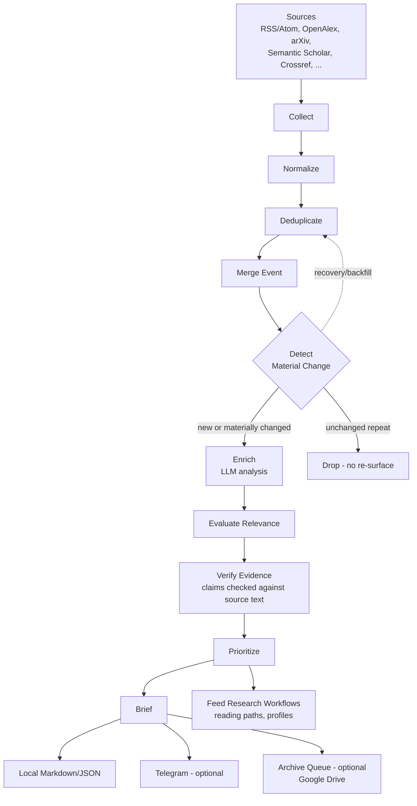

# Architecture

## Pipeline overview

```
Sources (RSS/Atom, OpenAlex, arXiv, Semantic Scholar, Crossref, ...)
  ↓
Collectors (cyber_radar/collectors/*)
  ↓
Normalization + Deduplication (cyber_radar/dedup.py)
  ↓
Cheap relevance filtering/scoring (cyber_radar/llm/relevance.py)
  ↓
LLM enrichment (cyber_radar/llm/news_analyst.py, paper_analyst.py)
  ↓
Operational / Academic selection (cyber_radar/run_pipeline.py)
  ↓
PostgreSQL (db/schema.sql)
  ↓
Digest (cyber_radar/digest.py)
  ↓
Local file (data/reports/*.md) / Telegram
  ↓
Optional archive queue (Google Drive, cyber_radar/drive_queue.py)
```

The same pipeline, as a diagram (source: `docs/assets/architecture.mmd`):



## Material change detection

Deduplication alone isn't enough — the same real-world event gets
reported by multiple sources, and a single event's facts change over
time (a CVE gains a KEV listing, an IOC appears, a fix ships). Rather
than either (a) treating every re-report as a new item, or (b) treating
an event as "seen" forever once shown once, this pipeline tracks each
merged event's structured fields (`cves`, `cisa_kev`,
`analysis.active_exploitation`, IOCs, `analysis.fixed_versions`, ...)
across runs and only re-surfaces an already-shown event when one of
those fields changes materially — see
`cyber_radar/dedup.py::is_material_news_update` and
`tests/test_material_update_comparator.py` for the exact, deterministic
comparison rules, and `docs/COMPARISON.md` /
`examples/output/sample_material_update.md` for a worked (synthetic)
example. Fields the comparator deliberately never looks at (title, URL,
source count, timestamps) can never trigger a re-surface by themselves —
this is a structural guarantee, not a tuning heuristic.

## Budget isolation

News analysis and academic-paper analysis draw from **independent**
daily LLM budget pools (`NEWS_DAILY_LLM_BUDGET`/`PAPERS_DAILY_LLM_BUDGET`).
A burst of academic collection can never starve news analysis of its
share, or vice versa. If you enable Research Profile A/B, those also get
their own independent budget pools (`RESEARCH_PROFILE_A_LLM_BUDGET`/`_B_LLM_BUDGET`)
that don't compete with the main news/paper pools.

## Provenance and hallucination guards

Structured fields extracted from source text (CVE, CWE, Windows Event
IDs, IOCs) are **mechanically re-checked against the original source
text** after the LLM call returns — if the model claims a CVE or IOC
that doesn't literally appear in the source, it's silently dropped
before it ever reaches the digest or the database. This is a second,
independent check on top of prompt-level instructions not to fabricate,
not a replacement for it.

The same principle applies to abstract-only paper analysis: when no
full text is available, fields that require it (reading guides,
figure/table references) are mechanically forced empty regardless of
what the model returns, not just requested via the prompt.

## Backfill

Both news and academic digest sections use the same backfill pattern:
if the current run didn't produce enough qualifying items for a
category's target, the category is filled from previously-analyzed,
not-yet-shown items in the database (with a same-day-repeat guard) —
never with fabricated or padded content. A category can legitimately end
up smaller than its target if there simply isn't enough real material.

## Rate limiting

External academic APIs (arXiv, OpenAlex, Semantic Scholar) are rate
limited by a **cross-process-safe** limiter using file-based locking
(`data/state/ratelimit_*.lock`), not just an in-process timer. This
matters if you ever run more than one collection process concurrently
(e.g. a scheduled run overlapping with a manual one) — both share the
same real-world timing state, so neither can push a shared host over its
rate limit independently of the other.

## Cache/reuse

A paper is uniquely identified by DOI/arXiv ID/normalized title at
insert time. Once a paper has been deep-analyzed (`analyzed_at` set),
it is never re-sent to the LLM, even if re-collected — structurally
enforced by the same `analyzed_at IS NULL` gate every analysis loop uses,
not a separate cache layer that could drift out of sync.

## Health checks

`cyber-radar doctor` and the collector-health report
(`_build_collector_health`, printed after every run — not sent to
Telegram, to avoid digest noise) cover: sources attempted/successful/
failed, news/papers collected, counts after dedup and after filtering,
and per-category fill status. Source-level anomaly detection compares
each source's result count against its own last successful run
(not just the total across all sources) and escalates a plain
warning to a stronger one if a source stays at zero results for several
consecutive runs.

## Not included in this public release

The following exist in the private deployment this was derived from,
but are intentionally not part of this release (see
`docs/PUBLIC_RELEASE_ACCEPTANCE.md` for the full export decision record):

- A systematic-literature-review workflow (PRISMA-style screening,
  evidence matrix, gap analysis, claim checking) — the two research
  profile slots here cover ad-hoc profile-driven analysis, not a full
  systematic review pipeline.
- Historical/backfill recovery tooling for re-scanning a past date range.
- NotebookLM export, spaced-repetition scheduling, weekly/monthly digest
  rollups, CISA KEV hourly watch, database backup/restore CLI.

These are all reasonable candidates for a future release; none were
excluded for security/privacy reasons, only to keep this release's
reviewable surface area manageable.
